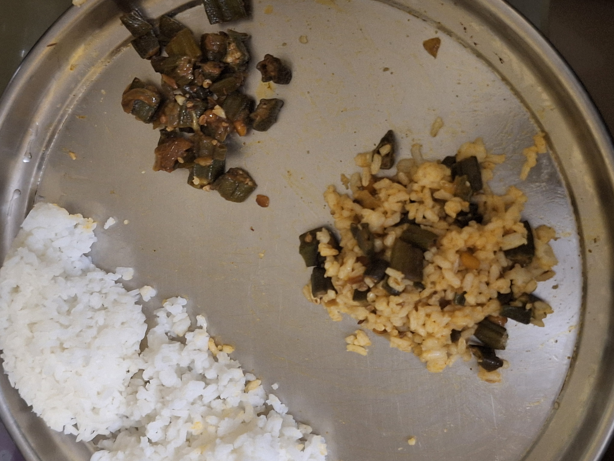
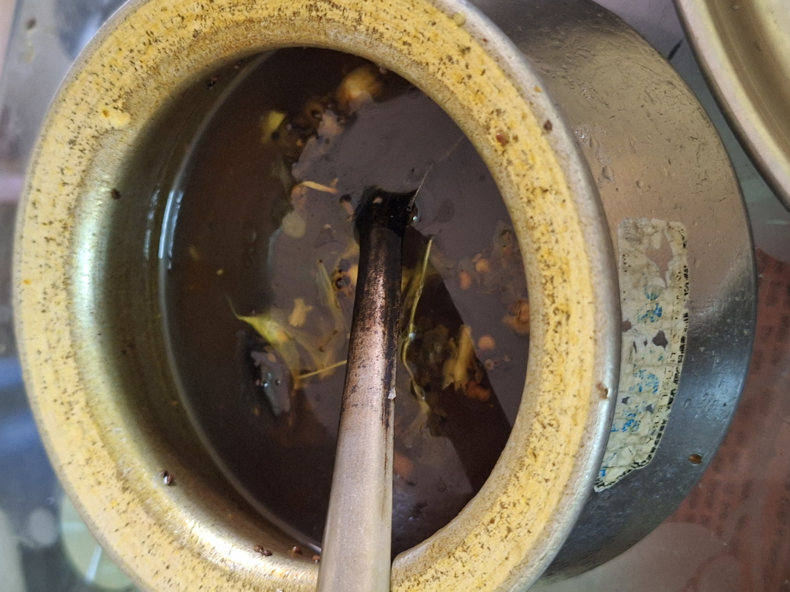
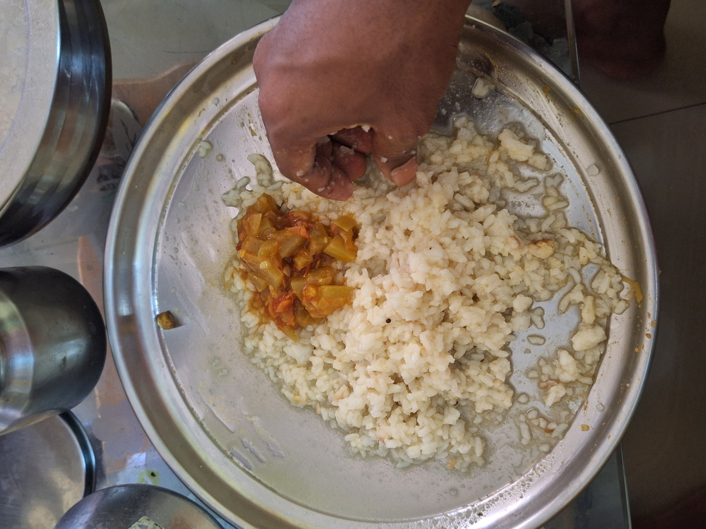

As I was having lunch today, a thought popped up - "I wonder what kind of foods do people in other countries eat everyday".

In India, where I live, we eat rice every day but mostly only for lunch. On a typical day, we'll have rice with one or two curries and either Rasam or Pappu. For my lunch today, I had white rice with Anapakaya Tomato curry (T: Bottle guard tomato curry), Bendakaya Fry (T: Ladies Fingers fried with onions, why is it named that? weird) with Rasam.

Rasam is made by boiling tamarind in water in the simplest sense. Pappu, also called Dal, is made by pressure cooking one of the many edible peas with water and some spices.

Okay, so we have rice, curries and a watery solution. How do I eat them? I follow a specific pattern. First, I'll eat rice mixed with one of the curries, then with the second. After I have tasted all the curries with rice, I'll add Rasam to the rice, then decide which curry to add to the mixture. Each curry when mixed with the rasam-rice mixture has a taste that is different from it's own. Today, I have picked anapakaya tomato curry to eat with rasam-rice, because I prefer curries over fries.

People usually avoid eating boiled rice for breakfast and dinner, but they do contain dishes in which rice is an essential ingredient.

India is the largest producer of rice in the world, followed very closely by China. Top 10 countries producing most rice are either South Asian or South East Asian. Rice is an essential staple for people in these regions. The reason it became one might be a combination of ease of growing it and high carbohydrate content.

I will research what people from other countries world wide eat on a typical day and publish findings in Part 2 of this essay tomorrow.
